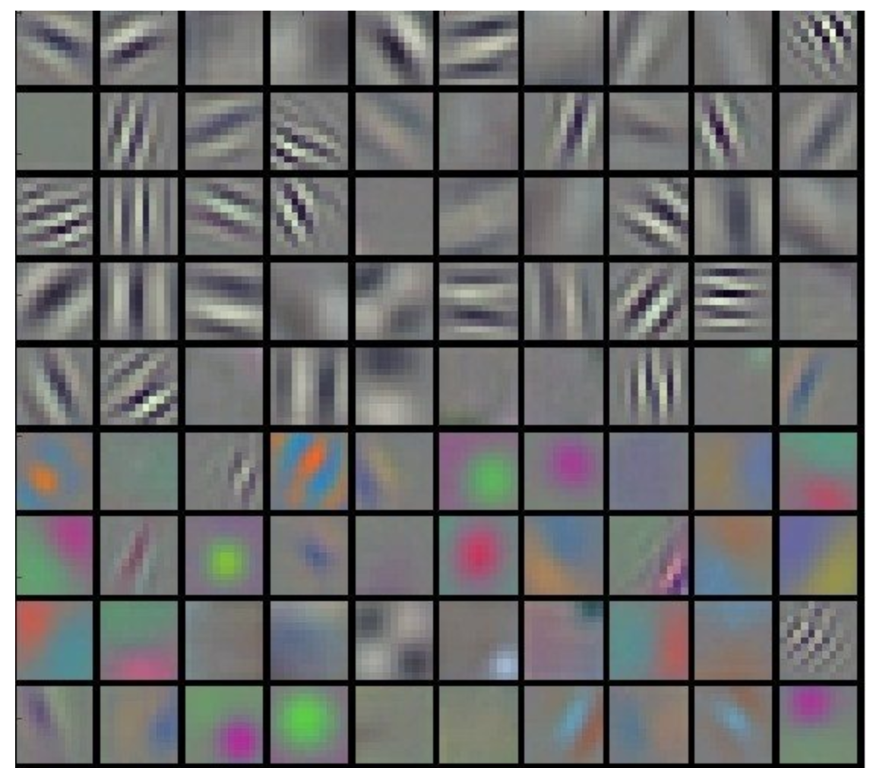

Assignment 1B for Session 1 EVA 

Colab Link to Assignment 1A : https://colab.research.google.com/drive/1A6J1s8-vTvNmBv5pcVIZDvY5pFKunSGK

**#1** What are Channels and Kernels (according to EVA)?

  **Channels are the bag of similar features .** Each channel may contain vertical edge feature , horizontal edges , etc like in the image shown below. Here each box is a channel that contains features extracted by a kernel or feature extractor 
  
  
  
  **Kernels or filters or feature extractors** convolve over an image to learn and extract the features that make up the image . each of the filters will result in a channel conatning similar feature sets . Below is an example of a 3x3 kernel (dark layer) convolving over a 5x5 image (purple layer) to produce a 3 x 3 output (green layer) 
  
    

**#2** Why should we only (well mostly) use 3x3 Kernels?

   3x3 kernels are mostly used because they are more memory efficient . For example performing a 3 x 3 convolution twice uses 
   9+9 =18 parameters and produces the same result as doing one 5 x 5 convolution which uses 5x5=25 parameters.   
   
   Due to the popularity of 3x3 kernels , the Graphic card makers have also optimized for 3x3 convolutions which then makes it more efficient to use a 3 x 3 kernel.

**#3** How many times do we need to perform 3x3 convolution operation to reach 1x1 from 199x199 (show calculations)

   **99 times** . Convolving a 3x3 filter (with no padding and stride 1) over a N X N input reduces the size to (N-2) X (N-2) .
   If we start with 199 X 199 image size , the first convolution will result in 197 X 197 and as we proceed the size reduces
   to 1 X 1 as follows (Here each | repesents a 3x3 convolution operation):
   
   199 | 197 | 195 | 193 | 191 | 189 | 187 | 185 | 183 | 181 | 179 | 177 | 175 | 173 | 171 | 169 | 167 | 165 | 163 | 161 |
   159 | 157 | 155 | 153 | 151 | 149 | 147 | 145 | 143 | 141 | 139 | 137 | 135 | 133 | 131 | 129 | 127 | 125 | 123 | 121 | 
   119 | 117 | 115 | 113 | 111 | 109 | 107 | 105 | 103 | 101 | 99 | 97 | 95 | 93 | 91 | 89 | 87 | 85 | 83 | 81 |
   79 | 77 | 75 | 73 | 71 | 69 | 67 | 65 | 63 | 61 | 59 | 57 | 55 | 53 | 51 | 49 | 47 | 45 | 43 | 41 |
   39 | 37 | 35 | 33 | 31 | 29 | 27 | 25 | 23 | 21 | 19 | 17 | 15 | 13 | 11 | 9 | 7 | 5 | 3 | 1 

