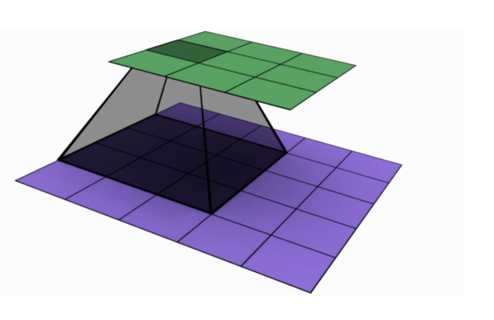

Assignment 1st DNN code : https://github.com/ravindrabharathi/Project1/blob/master/EIP4/session1/EIP4_1st_DNN.ipynb

### Convolution :

Convolution is a technique used in image and signal processing. In image processing by running or sliding a filter over an image (which can be considered as a 2D signal with 1 or more color channels) , we can achieve various outcomes like blurring, noise reduction, edge detection, sharpening, etc. In deep learning this concept is used in convolutional neural networks (CNN) to extract features from a signal or image. In CNN, several convolutional layers are used as hidden layers to extract and learn features of an image.

### Filters/Kernels : 

**Kernels or filters or feature extractors** convolve over an image to learn and extract the features that make up the image . each of the filters will result in a channel containing similar feature sets . Below is an example of a 3x3 kernel (dark layer) convolving over a 5x5 image (purple layer) to produce a 3 x 3 output (green layer) 
  
    

### Epochs :

In deep learning an epoch represents a run on the complete training set consisting of a forward pass and a back propagation(which updates the weights). A network may run several epochs until it is able to learn enough to minimise the loss and converge to a global minimum. Typically training continues until such time where further training would not reduce validation loss any more. Training beyond such points results in overfitting the model and the model will not generalize well for data that it has not seen before. In deep learning an epoch represents a run on the complete training set consisting of a forward pass and a back propagation(which updates the weights). A network may run several epochs until it is able to learn enough to minimise the loss and converge to a global minimum. Typically training continues until such time where further training would not reduce validation loss any more. Training beyond such points results in overfitting the model and the model will not generalize well for data that it has not seen before. 

### 1x1 Convolution :

1x1 Convolution is typically used to combine a larger number of feature maps / channels to a smaller number of channels. In very specific special cases , 1x1 convolution is used to increase the number of channels. The idea of using 1x1 Convolutions was first presented in the paper titled  'Network In Network' and later became part of popular CNN architectures like Inception.

### 3x3 Convolution :

3x3 convolution is the technique used in CNN where a 3x3 filter/kernel slides over an image (a 2D matrix of pixels (times 1 channel for greyscale , 3 channels for RGB, etc)) to extract features like edges initially and progressively more complex features like textures,patterns,parts of objects, objects as we go deeper into the neural network. 3x3 convolution is widely used as it helps you efficiently learn information with a lesser number of parameters. A convolution layer will have a number a channels with each channel being a container for features of similar nature e.g vertical edges.

3x3 kernels are mostly used in Deep Neural Networks because they are more memory efficient . For example performing a 3 x 3 convolution twice uses 
   9+9 =18 parameters and produces the same result as doing one 5 x 5 convolution which uses 5x5=25 parameters.   
   
   Due to the popularity of 3x3 kernels , the Graphic card makers have also optimized for 3x3 convolutions which then makes it more efficient to use a 3 x 3 kernel.

### Feature Maps :

Feature Maps or Channels are the bag of similar features which result from a convolution operation. When a kernels convolves over an input image (intermediate feature maps) , it extracts features like textures, patterns , parts of objects , etc . The extracted set of features that are similar in nature make up a Feature Map or Channel .

### Activation Function :

Activation functions are applied to the nodes in a neural network to decide whether that particular node will contribute forward to the next layer (if > threshold value) or not i.e if that particular node is important for the feature being learnt. An activation function adds non-linearity to the network which enables the network to learn more complex functions. There are several activation functions like step function, sigmoid , tanh , ReLU , Softmax, etc. The most popular activation function used in hidden layers is ReLU and for the output layers it is typically Softmax (multiclass classifier) or Sigmoid (binary classification)

### Receptive Field :

Receptive field is the region of an image / input that a certain layer(usually central pixel in the layer) of the CNN is able to look at. If we were to segregate the CNN as a series of separate layers , then the effective receptive field of a pixel /unit in a particular layer is the area that it can see of the input image and the local receptive field is the area that a pixel can see directly in front of it and is equal to the size of the kernel that resulted in this pixel. 

